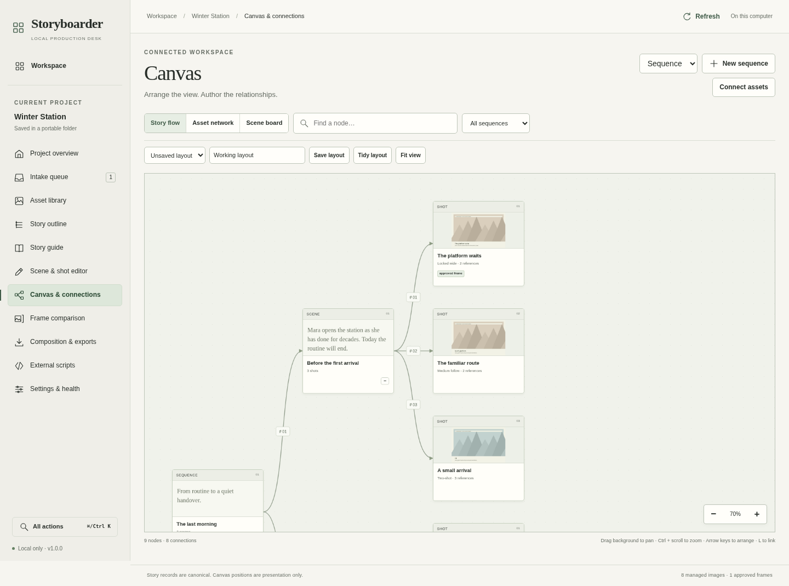
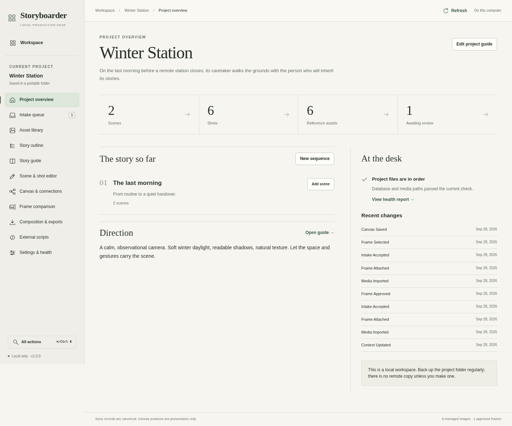

<p align="center">
  
</p>

<h1 align="center">Storyboarder</h1>

<p align="center">
  <strong>A local production desk for stories, references, and frames.</strong><br>
  Plan your shots. Keep your references connected. Build a storyboard you can share.
</p>

<p align="center">
  <a href="pyproject.toml"></a>
  <a href="LICENSE"></a>
</p>

<p align="center">
  <a href="#quick-start">Quick start</a> ·
  <a href="#cli-workflows">CLI workflows</a> ·
  <a href="#command-map">Command map</a> ·
  <a href="#source-documents-and-provenance">Source documents</a> ·
  <a href="#documentation">Documentation</a>
</p>



<p align="center"><em>The story flow canvas, using the included fictional Winter Station demo.</em></p>

Storyboarder is a local storyboard planning desk for filmmakers, storyboard artists, and
small production teams. Organize sequences into scenes, then plan multiple shots and
angles in each scene. Collect character, location, prop, and other references; record
framing and camera intent; compare storyboard images; and export boards and production
handoffs. Each project lives in a folder you choose. A shot can link to source elements
in an imported screenplay. Source links and production provenance are available through
the CLI and local API as preview workflows. Storyboarder records intent and connections;
it does not solve camera moves, render a film, or integrate with Blender.

People use the **browser** for visual planning and the **full-screen terminal desk** for
keyboard authoring. The **CLI** supports repeatable work by scripts and agents with
structured JSON output. All three work with the same project data. After installation,
core authoring and exports work offline. There is no account, subscription, or bundled
image-generation provider.

## What you can do

| Workflow | What Storyboarder gives you |
|---|---|
| **Plan the story** | Ordered sequences, scenes, and shots with action, dialogue, framing, camera direction, duration, and continuity notes. |
| **Organize references** | A typed library for characters, locations, props, and general references; tags, aliases, exact-image assignments, and duplicate intake review. |
| **Carry direction into each shot** | Project, sequence, scene, and shot notes that append to, replace, or exclude inherited direction. |
| **Arrange the production visually** | Story flow, asset network, and scene board canvases with pan/zoom, filtering, keyboard controls, typed connections, and saved layouts. |
| **Review storyboard images** | Separate frame candidates, version history, comparison, and explicit draft, selected, approved, or archived states. |
| **Deliver and recover** | HTML/PDF/PNG boards, JSON/Markdown handoff packages, managed media, manifest hashes, health checks, and portable backups. |
| **Automate your own tools** | Structured CLI output and explicitly registered local scripts with requests, logs, cancellation, result review, and approval. |

The current source also includes **ScreenJSON and OTIO JSON documents, immutable drafts,
and production provenance through the CLI and local API**. These are an implementation
preview; their dedicated browser and terminal workspaces are still unfinished.
See [source documents and provenance](#source-documents-and-provenance) for the supported workflow.

<details>
<summary><strong>See the project overview</strong></summary>



Screenshots show the original authoring interface. The reference panels are labelled
fictional demo graphics; they are examples of the workflow, not finished shot artwork.

</details>

## Quick start

**Requires Python 3.11 or later.** Clone the repository, or extract a source archive
and open a terminal in its `storyboarder` folder.

```sh
git clone https://github.com/mattrichmo/storyboarder.git
cd storyboarder
```

### macOS / Linux

```sh
python3 -m venv .venv
source .venv/bin/activate
python -m pip install .

storyboarder workspace init ./stories
storyboarder project create --workspace ./stories --slug my-film --title "My Film"
storyboarder ui --project ./stories/projects/my-film
```

<details>
<summary><strong>Windows PowerShell</strong></summary>

```powershell
py -3 -m venv .venv
.\.venv\Scripts\python.exe -m pip install .

.\.venv\Scripts\storyboarder.exe workspace init .\stories
.\.venv\Scripts\storyboarder.exe project create --workspace .\stories --slug my-film --title "My Film"
.\.venv\Scripts\storyboarder.exe ui --project .\stories\projects\my-film
```

Use `.\.venv\Scripts\storyboarder.exe` in place of `storyboarder` in the examples
below, or activate the virtual environment with `.\.venv\Scripts\Activate.ps1`.

</details>

The CLI walkthrough below uses POSIX shell syntax. On Windows, run it in Git Bash after
activating the virtual environment, or adapt the variable and pipeline syntax for
PowerShell.

Open **http://127.0.0.1:7430** if your browser does not launch automatically.
Keep the terminal running; **Ctrl+C** stops the server. Add `--port 7431` to use
another port, or `--no-browser` to skip automatic browser launch.

Installation normally downloads Python dependencies. The packaged React client is
already built: **Node, npm, a CDN, and API keys are not needed to use the app**.
For an offline first installation, prepare a wheelhouse on a connected machine;
see [installation and packaging](docs/DEVELOPMENT.md#fully-offline-installation-preparation).

### Try a populated demo

From the repository root, with the virtual environment active:

```sh
python scripts/create_demo.py ./stories/demo
storyboarder ui --workspace ./stories/demo
```

**Winter Station** includes a story guide, two scenes, six shots, reference assignments,
relationships, frame candidates, and a duplicate intake example. Use a fresh destination;
the script refuses to overwrite an existing project. Its generated panels are demo art.

### Choose your interface

| Interface | Start it | Best for |
|---|---|---|
| Browser | `storyboarder ui --project ./stories/projects/my-film` | Visual planning, reference review, canvas arrangement, and frame comparison for people. |
| Terminal | `storyboarder tui --project ./stories/projects/my-film` | Full-screen authoring and project review for people. |
| CLI | `storyboarder --project ./stories/projects/my-film shot list --json` | Repeatable commands for scripts and agents, with structured output. |

A standalone project works too: create it with
`storyboarder project create ./stories/standalone --title "My Film"`, then open it
with `storyboarder ui --project ./stories/standalone`. Workspace registration is optional.
Running bare `storyboarder` opens the terminal desk in an interactive terminal and
prints help in a non-interactive shell.

## CLI workflows

Commands discover a project from its folder or descendants. Use `--project/-p PATH`
to select one explicitly, or `--workspace/-w PATH` to use a workspace's current project.
These options, `--json`, `--jsonl`, and `--no-color` work before or after command groups.

### Build a scene with three shots

After the quick start, run this from the repository folder. It creates one sequence,
one scene, and three shots with distinct angles; the shell captures each returned ID so
the commands can run in order without editing placeholders. If you chose a different
workspace or project slug in the quick start, update `PROJECT` below to that project folder.

```sh
set -eu
PROJECT=./stories/projects/my-film

id_from_json() {
  python3 -c 'import json, sys; print(json.load(sys.stdin)["id"])'
}

SEQUENCE_ID=$(storyboarder --project "$PROJECT" sequence create \
  --title "Arrival" --json | id_from_json)
SCENE_ID=$(storyboarder --project "$PROJECT" scene create \
  --parent-id "$SEQUENCE_ID" --title "The station wakes" --json | id_from_json)
SHOT_ONE_ID=$(storyboarder --project "$PROJECT" shot create \
  --parent-id "$SCENE_ID" --title "Empty platform" --number "01" \
  --framing "Extreme wide" --camera "Locked off" --duration 8 \
  --action "The first train is due in minutes." --json | id_from_json)
SHOT_TWO_ID=$(storyboarder --project "$PROJECT" shot create \
  --parent-id "$SCENE_ID" --title "Mara arrives" --number "02" \
  --framing "Medium profile" --camera "Slow lateral track" --duration 6 \
  --action "Mara crosses the platform toward the signal box." --json | id_from_json)
SHOT_THREE_ID=$(storyboarder --project "$PROJECT" shot create \
  --parent-id "$SCENE_ID" --title "Signal detail" --number "03" \
  --framing "Close-up" --camera "Gentle push in" --duration 4 \
  --action "The signal changes from red to green." --json | id_from_json)

storyboarder --project "$PROJECT" shot list --parent-id "$SCENE_ID" --json
storyboarder --project "$PROJECT" shot show --id "$SHOT_ONE_ID" --json
storyboarder --project "$PROJECT" doctor --hashes --json
storyboarder --project "$PROJECT" export board --owner-id "$SCENE_ID" --format html --json
```

The list returns all three shots. The `show` command reads the first shot, `doctor`
checks project health, and the HTML export writes a board under the project's
`exports/boards` folder. Each command's `--help` describes its flags:

```sh
storyboarder --help
storyboarder shot create --help
storyboarder document --help
```

### Bring in references and storyboard images

Continue in the same shell as the previous walkthrough. The shell variables `$PROJECT`
and `$SHOT_ONE_ID` name that project and the first generated shot. Replace the two input
paths below with an existing reference folder and an image file you want to add.

```sh
REFERENCE_DIR="/path/to/references"
FRAME_PATH="/path/to/frame.png"

# Import still images into the intake queue for review.
storyboarder --project "$PROJECT" import "$REFERENCE_DIR" --recursive --json
storyboarder --project "$PROJECT" intake list --state pending --json

# Create a library item, or accept imported images into one through intake accept.
storyboarder --project "$PROJECT" asset create --title "Mara" --type character --tags "winter,caretaker" --json

# Add a storyboard candidate to a specific shot.
storyboarder --project "$PROJECT" frame add --shot-id "$SHOT_ONE_ID" --path "$FRAME_PATH" --json
storyboarder --project "$PROJECT" frame list --shot-id "$SHOT_ONE_ID" --json
```

Imported references and storyboard candidates have separate roles. Review intake with
`intake accept`; use `assignment create` to connect a library item and, optionally,
an exact reference image to a shot. Use `frame state --id FRAME_ID --revision REVISION
--state approved` to approve a candidate after reading its current revision.

### Export, check, and back up

Continue in the same shell as the walkthrough so `$PROJECT` and `$SCENE_ID` are set.
The HTML export reports the board path. `backup` writes an archive into the project.

```sh
storyboarder --project "$PROJECT" doctor --hashes --json
storyboarder --project "$PROJECT" export board --owner-id "$SCENE_ID" --format html --json
storyboarder --project "$PROJECT" backup --json
```

Export and backup results include their output paths. Restore a backup into a **new**
folder with `storyboarder restore /path/to/backup.zip /path/to/restored-project`.

### Use JSON in scripts

`--json` returns structured results and errors; `--jsonl` emits one result per line
and sends pagination metadata to stderr. Commands that support paging expose `--limit`
and `--offset`; inspect `next_offset` to continue.

```sh
storyboarder shot list --limit 50 --offset 0 --json
storyboarder shot list --jsonl
storyboarder asset create --payload '{"title":"Brass key","type":"prop"}' --json
storyboarder shot create --payload @shot.json --json
```

`shot.json` must contain a JSON object with the required `title` and `parent_id` fields.
Named flags override values in `--payload`. Update and removal commands that require
`--revision` must use the value you just read from that record. A stale revision exits
with a conflict instead of overwriting newer work. See the
[CLI reference](docs/CLI.md#output-payloads-and-exit-codes) for exit codes and error output.

## Command map

Every group and subcommand has `--help`. The
[full CLI reference](docs/CLI.md#command-catalog) documents all **111 shared application
commands**, including their flags, choices, defaults, and required fields, plus lifecycle commands.

| Area | Commands to reach for |
|---|---|
| Launch and select projects | `ui`, `tui`, `workspace init/list/register/switch`, `project create/open/show/list/switch` |
| Story and guide | `sequence`, `scene`, `shot` → `create/update/list/show`; `project update`, `story move` |
| Library and relationships | `asset create/update/list/show/attach/primary/detach/merge`, `link create/list/remove` |
| Import and review | `import`, `media import/list/show/tags`, `intake list/accept/discard` |
| Shot references and direction | `assignment create/update/list/remove`, `context put/resolve/list/remove` |
| Storyboard candidates | `frame add/attach/list/state/remove` |
| Canvas arrangements | `canvas graph/neighbors/save/show/list/remove` |
| Composition and handoffs | `compose`, `composition preview`, `export board/bundle` |
| Source drafts | `screenplay import/list`, `edit import/list`, `document import/list/show/tree/children/node/versions/validate/revise/diff/export/archive/restore` |
| Production lineage and notes | `shot link-source/sources`, `provenance link/trace/impact/retire`, `coverage report`, `annotation create/list/update` |
| Local adapters | `script register/list/remove`, `job create/run/preview/cancel/retry/approve/list` |
| Maintenance and recovery | `doctor`, `backup`, `restore`, `project doctor/backup/sync`, `cache rebuild/clear`, `entity update/usage/archive/restore/delete` |

## Source documents and provenance

**CLI / local API preview.** Import ScreenJSON core-profile screenplays and OTIO JSON
editorial timelines as separate documents. Imports preserve original bytes and hashes;
creative revisions create immutable versions. Explicit links connect source elements
to storyboard shots and frames, and can connect those results to editorial clips.

From a project folder, using your own supported source files. Replace uppercase ID
placeholders with values returned by the preceding import, tree, and shot commands:

```sh
# Validate without creating a document, then import a screenplay draft.
storyboarder screenplay import --path /path/to/draft.screenjson --dry-run --json
storyboarder screenplay import --path /path/to/draft.screenjson --label "White draft" --json

# Inspect the document ID returned by import.
storyboarder document tree --document-id "DOCUMENT_ID" --limit 100 --json
storyboarder document versions --document-id "DOCUMENT_ID" --json

# Link a source-node ID from the tree to a storyboard shot.
storyboarder shot link-source --shot-id "SHOT_ID" --node-id "NODE_ID" --json
storyboarder shot sources --id "SHOT_ID" --json
storyboarder provenance trace --kind entity --record-id "SHOT_ID" --direction upstream --json

# Bring in an editorial cut and report explicit coverage links.
storyboarder edit import --path /path/to/assembly.otio --json
storyboarder coverage report --json
storyboarder document export --document-id "DOCUMENT_ID" --json
```

Source-node IDs identify elements in a particular immutable draft. A link records an
explicit relationship; it does not by itself assert that the shot semantically covers a
story beat. Existing links stay pinned when a new draft arrives; `document diff` and
`provenance impact` help review what changed. Coverage reports describe explicit links,
rather than infer missing footage.
OTIO imports preserve media references without fetching or playing the referenced media.

Dedicated source-document workspaces and visual draft comparison remain unfinished; the
terminal desk includes a focused exact Observation coverage page. Fountain, FDX, PDF screenplay imports, and general
NLE interoperability are not implemented. Read the [format profiles](docs/FORMATS.md)
and [implementation status](docs/V2_IMPLEMENTATION_STATUS.md) before adopting these
preview workflows. Back up existing projects before opening them with the newer schema.

## Portable projects

A **workspace** is an optional navigator for multiple projects. Each **project** has
its own SQLite database, managed images, source documents, and exports.

```text
stories/
├── workspace.toml                 # workspace navigation and selection
└── projects/
    └── my-film/
        ├── project.toml           # project identity and title hint
        ├── .storyboarder/
        │   ├── storyboard.sqlite3 # canonical project data
        │   ├── cache/             # rebuildable image previews
        │   ├── staging/           # temporary import/export work
        │   └── jobs/              # requests, pending results, and logs
        ├── media/
        │   ├── items/             # managed reference images
        │   └── frames/            # storyboard image files
        ├── sources/               # retained document bytes, created on import
        └── exports/               # boards, handoffs, documents, and backups
```

Media paths are relative to the project. Use `backup` for a SQLite-consistent archive;
stop writers before moving or copying a live project folder. A copied project retains
its identity; explicitly register its new path to choose the preferred copy.

The repository's `stories/` directory is ignored by Git. Keep production data there
or outside the checkout, and keep separate backups of material you care about.

## Documentation

| If you want to… | Read |
|---|---|
| Walk through a production project | [Creator guide](docs/CREATOR_GUIDE.md) |
| Find exact CLI flags and output behavior | [CLI reference](docs/CLI.md) · [Command schema catalog](docs/commands.json) |
| Work in the terminal or canvas | [Terminal desk](docs/TUI.md) · [Canvas and accessibility](docs/CANVAS.md) |
| Understand references, direction, and delivery | [Context and media](docs/CONTEXT_AND_MEDIA.md) · [Exports and recovery](docs/EXPORTS_AND_RECOVERY.md) |
| Import screenplay and editorial sources | [Format profiles](docs/FORMATS.md) · [Implementation status](docs/V2_IMPLEMENTATION_STATUS.md) |
| Integrate a local tool | [Local API](docs/API.md) · [External script contract](docs/AUTOMATION.md) |
| Understand the product and its internals | [Product contract](docs/PRODUCT_CONTRACT.md) · [Architecture](docs/ARCHITECTURE.md) · [Design brief](docs/DESIGN_BRIEF.md) |
| Develop, package, or inspect verification | [Development](docs/DEVELOPMENT.md) · [Implementation matrix](docs/IMPLEMENTATION.md) · [Verification report](docs/TEST_REPORT.md) |

## Development

Use an active Python virtual environment. **Node 20+** is recommended for rebuilding
the frontend. End users can run the checked-in client without Node.

```sh
python -m pip install -e '.[dev]'
cd clients/web
npm ci
npm run typecheck
npm test
npm run build
cd ../..
python -m pytest
python scripts/build_release.py
```

`npm run dev` watches TypeScript/CSS and rebuilds packaged assets. Run `storyboarder ui`
separately and refresh after a rebuild. The release helper creates a wheel and source
archive in the ignored `dist/` directory; those files are generated, not included in a
fresh Git clone. Install a generated wheel with
`python -m pip install dist/storyboarder_desk-1.0.0-py3-none-any.whl`.


## Scope and trust

Storyboarder runs on loopback for local authoring. Keep its server local. Cloud sync,
live collaboration, user accounts, in-app drawing, automatic script breakdown,
video/audio ingestion, and bundled generation providers are outside the current product.
Importing editorial metadata does not turn it into a video editor.

Registered adapters are trusted local executables with your OS permissions. Review a
script before registering it; generated outputs remain pending until you approve them.
See the [script contract](docs/AUTOMATION.md) and [security boundaries](docs/SECURITY.md).

HTML/JSON exports retain full text. Fixed-size PDF and image panels abbreviate long
notes and use portable built-in fonts; inspect exports before a production handoff.

## License

Application code is [MIT licensed](LICENSE). The bundled React 18.2.0 runtime and
ReactDOM attributions are in [THIRD_PARTY_NOTICES.md](THIRD_PARTY_NOTICES.md) and
[the vendored license file](clients/web/vendor/THIRD_PARTY_LICENSES.txt).
